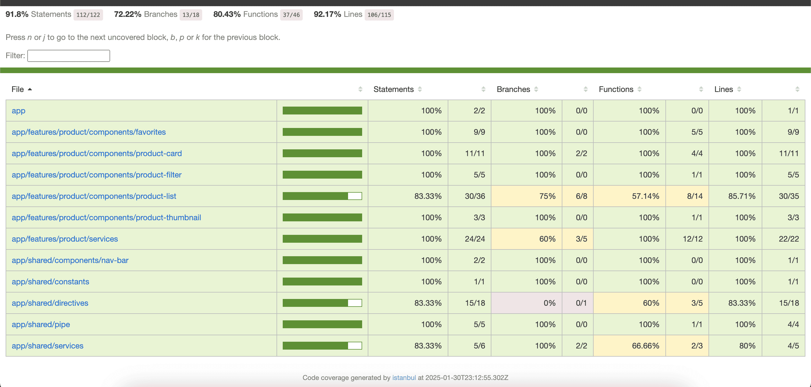

# PRODUCT APP (Version 1.0.0)

A Product viewer Application, Using Angular 19 . Standalone components . Typescript . Jasmine . Karma . Eslint

The Product App is built using Angular 19 and follows a scalable, maintainable architecture with optimized performance and reusable components.

## Table of Contents

- [Getting Started](#getting-started)
  - [Installation](#installation)
  - [Running the Application](#running-the-application)
- [Folder Structure](#folder-structure)
- [Development Features](#development-features)
  - [Unit Test](#unit-test)
  - [Code Coverage](#code-coverage)
  - [Lint and Format](#lint-format)
  - [UI UX](#ui-ux)

## Getting Started

### Installation

#### Clone the repository:

Open your terminal or command prompt, go to the desired directory, and use the following command to clone the angular project:

Install the Angular 
Step 1
```
npm install -g @angular/cli
```
Step 2
Download Node and Install

```
https://nodejs.org/en
```

Step 4
```
git clone https://github.com/maheshpeechamkoli/product-app.git
cd product-app
```

#### Running the Application

```
npm install
```

```
ng serve
```

## Folder Structure

```
    product-app/src/app/
    ├── core/                  # Global application-level services and interceptors
    ├── features/product/      # Product-related components, models, and services
    │   ├── components/        # UI components (e.g., product list, card, filter)
    │   ├── models/            # Data models and interfaces
    │   ├── services/          # http api service
    │   └── product.routes.ts  # Feature routing configuration
    ├── shared/                # Shared reusable components, pipes, and directives
    │   ├── components/        # Reusable UI components like navbar
    │   ├── directives/        # Custom directives for reusable behaviors
    │   ├── pipes/             # Custom pipes for data transformation
    │   └── services/          # Shared application services
    └── styles/                # Global SCSS styles and variables
```

## Development Features

    1.  Standalone Components:
        Adopted Angular's standalone component architecture for better encapsulation and lazy loading.
        
    3. OnPush Change Detection:
        Improved rendering performance by using ChangeDetectionStrategy.OnPush to minimize DOM updates.
       
    5. Reusable Pipes and Directives
        Improved rendering performance by using ChangeDetectionStrategy.OnPush to minimize DOM updates.
       
    7. Reusable Components
        Built reusable components like ProductCard and ProductThumbnail for consistent and maintainable UI.
       
    9. Unit Testing
        Achieved high code coverage with Jasmine and Karma unit tests.
       
    11. Code Quality and Formatting
        Ensured code quality with ESLint and formatting consistency with Prettier

#### Benefits

    1.Performance
        OnPush strategy and optimized infinite scroll reduce unnecessary change detection and API calls.
        Debounce feature minimizes user interface latency.
    2.Scalability
        Modular architecture allows for easy extension with new features.
        Reusable components, directives, and pipes promote maintainability.
    3.Maintainability
        Standalone components simplify project configuration.
        Global SCSS variables ensure consistent styling across the application.
    4.Code Quality
        ESLint and Prettier maintain clean, readable code.
        Unit testing ensures robustness and early bug detection.

### Unit Test

    ```
    ng test
    ```


### Code Coverage

    ```
    ng test --code-coverage
    ```

    Run the coverage report and identify which parts of your code are not covered. Use  the following command to generate the coverage report:

    ```
    ng test --no-watch --code-coverage
    ```



### Lint and Format

    "validate": "npm run lint && npm run format:check"

    ```
    npm run validate
    ```

## UI UX

### Product List


### Product Card


### THANK YOU SO MUCH
